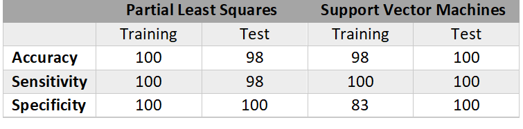

```{r setup, include=FALSE}
knitr::opts_chunk$set(echo = TRUE)

#https://rpubs.com/Saulabrm/PLS1
#https://www.displayr.com/using-partial-least-squares-to-conduct-relative-importance-analysis-in-r/

library(dplyr)
library(pls)
library(caret)
```

### Introduction

MicroRNAs (miRNAs) are small, noncoding RNAs that regulate gene expression. Their alteration has been associated with several types of human cancer and their expression profiles have been used to classify tumors. In a recent paper by Matamala et al. titled "Tumor MicroRNA Expression Profiling Identifies Circulating MicroRNAs for Early Breast Cancer Detection", miRNAs deregulated (i.e. under- or over-expressed) in breast tumors were identified using differential expression analysis and support vector machines (SVM). These miRNAs were then compared with circulating miRNAs in plasma to determine their potential as noninvasive biomarkers for early breast cancer detection.

This project aims to predict breast tissue type (cancerous vs normal) based on miRNA expression profiles and to determine which miRNAs are most representative in this predictive model. These results are then compared to the predictive performance of the paper's SVM classifier and the most relevant miRNAs identified in the paper.


### Dataset Description

The microarray dataset from the paper is publicly available at the National Center for Biotechnology Information's Gene Expression Omnibus (GEO) database under GEO accession number [GSE58606](https://www.ncbi.nlm.nih.gov/geo/query/acc.cgi?acc=GSE58606). The series matrix file contains the expression profiles of 1,926 miRNAs in 133 breast tissue samples, where each sample is from a different woman. Seven of these miRNAs are negative controls. The dataset also contains variables such as Sample Title, Tissue, and Dataset.Group. Sample Title is a unique numerical identifier for each sample, Tissue identifies the sample tissue type as either "primary breast cancer" or "normal breast tissue", and Dataset.Group identifies the sample as belonging to either the "Test" or "Training" group. 

This same dataset can also be found on [Kaggle](https://www.kaggle.com/rhostam/primary-breast-cancer-vs-normal-breast-tissue), but it only contains the miRNA expression profiles and tissue type. The miRNA variable names in this dataset contain a multi-digit number followed by a label starting with "hsa-miR-", whereas the miRNA names in the GEO dataset just contain the number and not the label. Therefore, the GEO dataset was primarily used because it contained the training and test set designations, but then the Kaggle dataset was cross-referenced when referring to the miRNAs by name.

```{r data}

setwd("~/Machine Learning/Final Project")
load("raw_data.RData")

GEO.data = read.csv("GSE58606_data.csv", header=T)

# separate metadata from the raw data
meta = raw.data[,c(1:5)]
colnames(meta)[5] = "Group"
data = raw.data[,-c(1:5)]

colnames(data) = substring(colnames(data), 2)
rownames(data) = meta$Sample.Title
data = cbind(Tissue = meta$Tissue, data)
```


### Descriptive Statistics / Visualizations

The distribution of tissue sample type by group (i.e. training or test set) can be seen in the following plot.

```{r graphs}

table = table(meta$Group, meta$Tissue)
table2 = table[,c(2,1)]
plot = barplot(table2, beside=T, ylim=c(0,70), main="Tissue Samples by Group", 
               width=0.75, legend=T, ylab="Count", 
               col=c("steelblue", "lightblue"), space=c(0.1,0.7))
text(x = plot, y = table2, label = table2, pos = 3)
```

The plot shows that 122 samples (out of 133) are primary breast cancer and only 11 are normal breast tissue. It also shows that the training set contains 69 samples (61 cancer, 7 normal) and the test set contains 65 samples (61 cancer, 4 normal). So, both sets have an equal number of cancer samples, but the training set contains 3 more normal samples.


### Methods

The data was first filtered to remove miRNAs with low expression variation across samples (< 0.03) based on the procedure described in the paper, resulting in 699 remaining miRNAs. The predictors in both the training and test sets were then centered according to the predictor means of the training set. They were not scaled because their variation could be important.

```{r filter}

variance = apply(data, 2, var)
data.filtered = data[,-which(variance<0.03)]

# change the tissue variable into a 0/1 dummy variable, where 1 = cancer
data.filtered$Tissue = ifelse(data.filtered$Tissue=="primary breast cancer", 1, 0)
```

```{r test_train}

# split the data into the pre-designated training and test sets
train = data.filtered[which(meta$Group=="Training"),]
test = data.filtered[which(meta$Group=="Test"),]

# center but not scale the predictors (the variance may be important)
#  - center the test set based on the means of the training set
train.scaled = scale(train[,-1], scale=F)
test.scaled = scale(test[,-1], center=colMeans(train[,-1]), scale=F)

# combine the scaled predictors with the response variable
training = as.data.frame(cbind(tissue=train[,1], train.scaled))
testing = as.data.frame(cbind(tissue=test[,1], test.scaled))
```

Since the data contains a large number of predictors relative to the sample size, a dimension reduction method was implemented before building the classifier. Partial least squares (PLS) was chosen because it aims to maximize the amount of variability explained in both the predictors and the response, whereas other methods such as principal component analysis (PCA) just maximize the variance with respect to the predictors. With prediction as the goal, the response should be used to build the model.

After PLS was performed on the training data, cross-validation was used to determine the optimal number of components to include. The blue line on the following plot shows that two components were chosen, which corresponds to a local minimum. A smaller number of components is preferred in order to not overfit the model, hence why a local, not the global, minimum was chosen. This choice was also supported by the onesigma approach, in which the optimal cross-validation error is within one standard error of the absolute optimum. 

```{r pls}

# perform partial least squares on the training data
set.seed(1)
pls.fit = plsr(tissue ~ ., data = training, ncomp = 20, validation = "CV")

plot(MSEP(pls.fit), main = 'MSE vs Number of Components', 
     xlab = 'Number of Components', ylab = 'Mean Squared Error', legend = "topright")
abline(v = 2, col = "steelblue")
#selectNcomp(pls.fit, method = "onesigma", plot = TRUE)

# refit the model with the chosen number of components
pls.fit = plsr(tissue ~ ., data = training, ncomp = 2, validation = "CV")
```

The test data was then projected as additional samples onto the selected components from the training data. A plot of the two components for both the training and test sets can be seen below, colored by tissue sample. The plot shows the types of tissue are fairly well separated by these two components, with slightly more separation seen in the training set than the test set, which is to be expected.

```{r project}

# projection for the test set (remove the response)
test.projection = as.matrix(testing[,-1]) %*% pls.fit$projection

# plot the components, colored by each factor
plot(pls.fit$scores, col=as.factor(training[,1]), main="PLS 1st vs 2nd Component")
points(test.projection, pch=19, col=as.factor(testing[,1]))
legend("topleft", c("normal (training)","cancer (training)","normal (test)",
                   "cancer (test)"), pch=c(1,1,19,19),
       col=c("black","red","black","red"))
```

A logistic regression model was then built on the training data using these two components. PLS regression was not used because it assumes a continuous outcome and produces fitted and predicted values outside the (0,1) range of probabilities for a binary outcome. However, training the logistic model did produce convergence warnings, so PLS with discriminant analysis (PLS-DA) or canonical powered PLS (CPPLS) might be more appropriate in future analyses.

```{r predict, warning=F, message=F}

pls.pred = predict(pls.fit, testing, ncomp = 2)
MSE.pls = mean((testing$tissue - pls.pred)^2)

# set up a dataframe with the components and response
trainingset = as.data.frame(cbind(Y=training[,1], pls.fit$scores))
names(trainingset) = c("Y", paste0("X", 1:(ncol(trainingset)-1)))

testingset = as.data.frame(cbind(Y=testing[,1], test.projection))
names(testingset) = c("Y", paste0("X", 1:(ncol(testingset)-1)))

# build the Model
glm.fit = train(as.factor(Y) ~., data=trainingset, method="glm", family="binomial")
predict.training = predict(glm.fit)
cm.training = table(training[,1], predict.training)
accuracy = sum(diag(cm.training))/sum(cm.training)

# predict on the test data
predict.test = predict(glm.fit, newdata=testingset, type='raw')
```


### Analysis / Results

The logistic regression model built using the PLS components predicted perfectly on the training set and only misclassified 1 sample out of 65 from the test set. These results are compared with the paper's SVM classifier in the table below. The SVM classifier surprisingly predicted perfectly on the test data rather than the training data.

```{r results}

# calculate test accuracy
cm.test = table(predict.test, testing[,1])
accuracy = sum(diag(cm.test))/sum(cm.test)

# calculate test sensitivity (true positive rate) & specificity (true negative rate)
cm.test = as.data.frame(cm.test)
names(cm.test) = c("predicted", "true", "count")
sensitivity = cm.test[cm.test$predicted==1 & cm.test$true==1,"count"] / sum(cm.test[cm.test$true==1,"count"])
specificity = cm.test[cm.test$predicted==0 & cm.test$true==0,"count"] / sum(cm.test[cm.test$true==0,"count"])
```




The relative importance of each miRNA in the PLS model was also calculated by normalizing the model coefficients. These normalized scores were ordered and the top positive and negative predictors from the model are shown in the plots below.

```{r importance}

coefficients = coef(pls.fit)
sum.coef = sum(sapply(coefficients, abs))
coefficients = coefficients * 100 / sum.coef
coefficients = sort(coefficients[, 1, 1])

par(mar=c(5,2,4,8)+.1)
par(mar=c(5,7.5,4,2)+.1)
top5.neg = sort(head(coefficients, 5), decreasing=T)
top5.neg = abs(top5.neg)
plot2 = barplot(top5.neg, names.arg=c("miR-3656", "miR-4488", "miR-2964a-5p", "miR-4516", "miR-125b-5p"), col="steelblue", xlab="Relative Importance Score", main="Top 5 Negative Predictors", horiz=T, las=1, space=0.75)

par(mar=c(5,7.5,4,3)+.1)
plot3 = barplot(tail(coefficients, 5), names.arg=c("miR-548as-3p", "miR-141-3p", "miR-4668-5p", "miR-3613-3p", "miR-21-5p"), col="steelblue", xlab="Relative Importance Score", main="Top 5 Positive Predictors", horiz=T, las=1, space=0.75, xlim=c(0,1.6))
```

All of these top predictors, except for miR-2964a-5p, were cited in the paper as having the greatest difference in expression between breast tumors and healthy breast tissues. Four miRNAs (miR-125-5b, miR-3613-3p, miR-4668-5p, and miR-3656) were also included in the signature generated by the paper's SVM classifier. Both miR-125b-5p and miR-21-5p have been repeatedly associated with breast cancer, but six miRNAs (miR-3613-3p, miR-4668-5p, miR-4516, miR-548as-3p, miR-4488, and miR-3656) had not been associated with breast cancer before. Three (miR-21-5p, miR-125b-5p, and miR-3656) were also found to be differentially expressed in plasma.


### Discussion / Conclusions

Based on the results from the relative importance scores, PLS with just two components produced an almost identical list of top miRNAs as the paper's differential expression analysis and it produced an additional miRNA (miR-2964a-5p) not selected by the paper that would be worth further analyzing. It also confirmed the role of miR-21-5p and miR-125b-5p in discriminating against breast cancer in this dataset. However, it should be noted that several of the miRNAs are likely to be correlated since the number of predictors is much larger than the sample size, meaning the scores could be either under- or over-estimated depending on this correlation. 

Based on the prediction results, the performance of the PLS classifier is very comparable to that of the SVM classifier, with the difference potentially due to randomness. The performance of the PLS classifier could also be enhanced by including more components. As mentioned before, other PLS methods specifically designed for categorical outcomes (e.g. PLS-DA, CPPLS) should be evaluated and compared with the PLS-logistic model. It would also be interesting to use a different training and test set, especially with a different proportion of normal tissue samples, and compare with the results from the paper. 


### References

Matamala, N., Vargas, M. T., Gonzalez-Campora, R., Minambres, R., Arias, J. I., Menendez, P., . Benitez, J. (2015). Tumor MicroRNA Expression Profiling Identifies Circulating MicroRNAs for Early Breast Cancer Detection. Clinical Chemistry, 61(8), 1098-1106. doi: 10.1373/clinchem.2015.238691

James, G., Witten, D., Hastie, T., & Tibshirani, R. (2017). An introduction to statistical learning: with applications in R. New York: Springer.

Garcia, S. (2016, December 17). Partial Least Squares for Leukemia Dataset. Retrieved November 26, 2019, from https://rpubs.com/Saulabrm/PLS1.

Hoare, J. (n.d.). Using Partial Least Squares to Conduct Relative Importance Analysis in R. Retrieved November 26, 2019, from https://www.displayr.com/using-partial-least-squares-to-conduct-relative-importance-analysis-in-r/.
